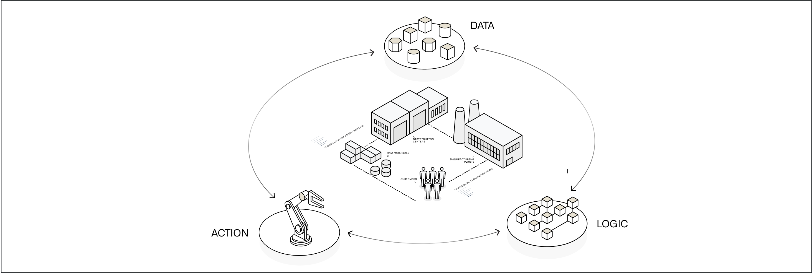
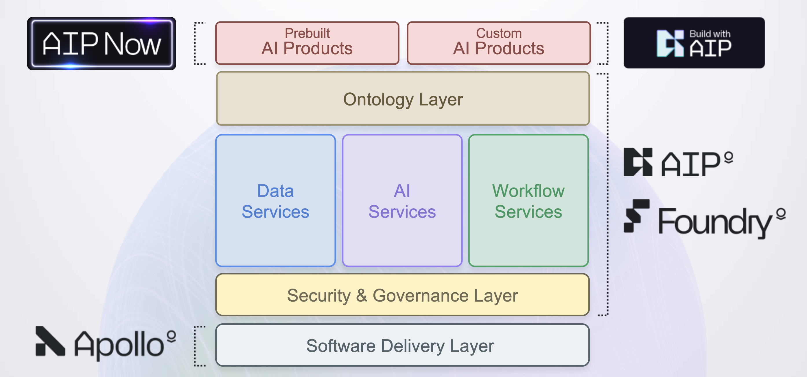
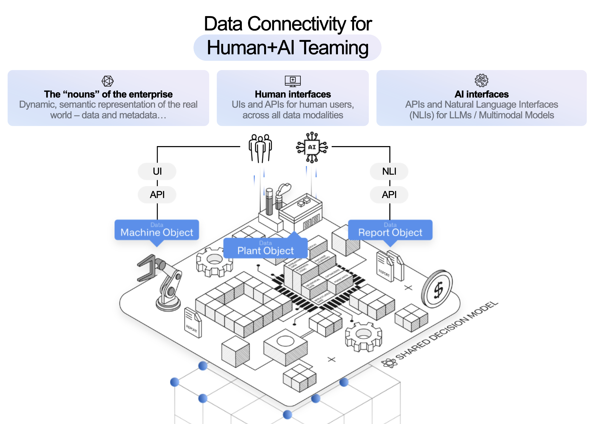
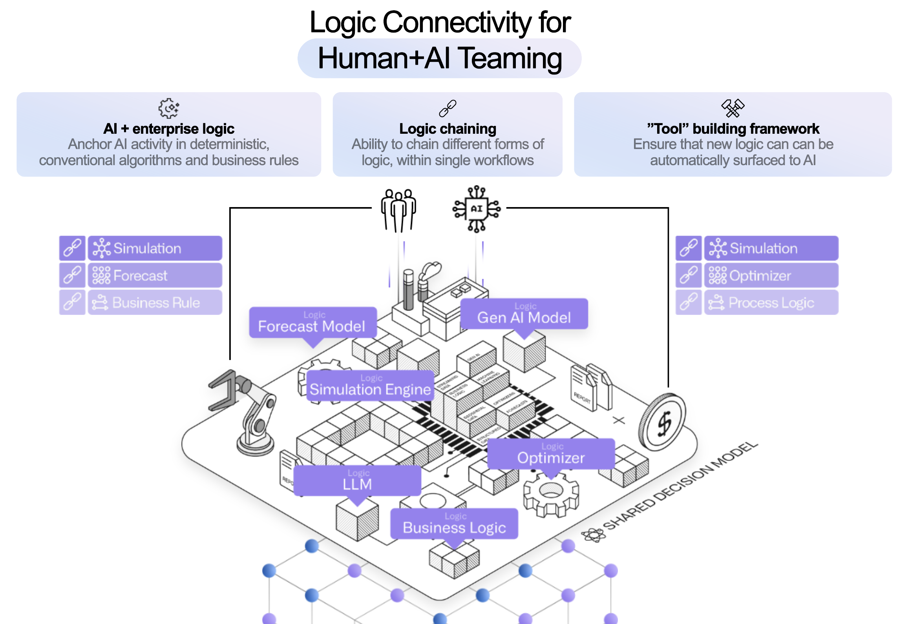
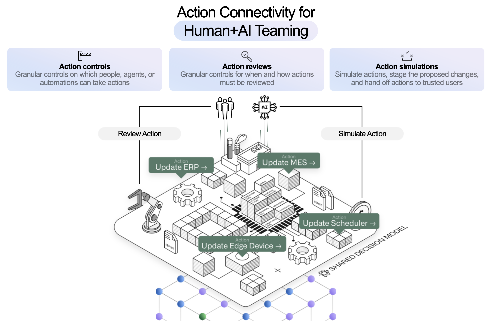

# 平台概览

> 来源：https://www.palantir.com/docs/foundry/platform-overview/overview

## 平台概览

Palantir AIP 为全球最关键的商业和政府场景提供实时的 AI 驱动决策能力。从公共卫生到电池生产，各组织都依赖 Palantir 在其企业中安全、可靠、有效地利用 AI，并推动运营成果。

简而言之，Palantir AIP 将生成式 AI 与运营连接起来。AIP 与 Foundry（Palantir 的数据运营平台）以及 Apollo（Palantir 的自主软件部署任务控制）共同构成一个 _AI 网格（AI Mesh）_，可提供全系列的 AI 驱动产品，从基于 LLM 的 Web 应用程序到使用视觉语言模型的移动应用程序，再到嵌入本地化 AI 的边缘应用程序。我们将这整套能力、功能和工具集称为 _Palantir 平台_。

虽然许多因素有助于通过 Palantir 平台实现并扩大运营影响力——包括 AIP 训练营（AIP Bootcamps），客户可以在其中亲手操作，在数小时内实现 AI 成果——但关键区别在于一个围绕 Palantir 本体（Ontology）构建的软件架构。

## 本体

本体的设计旨在表示企业中的_决策_，而不仅仅是数据。世界上每个组织都面临着如何执行最佳决策的挑战，通常需要实时做出决策，同时还要应对不断变化的内外部条件。

这些决策过程的复杂性反映在本体中，本体促进了与现有企业系统的深度双向互操作性。本体自动将相关的数据、逻辑和行动组件集成到一个现代化的、AI 可访问的计算环境中。这解锁了运营应用程序的快速开发，这些应用程序支持 AI 协作，以及传统的商业智能和分析工作流。

## 决策组件

每个决策都可以分解为 __数据__、__逻辑__ 和 __行动__。

- __数据：__ 构成此决策背景的、关于世界和我们运营的相关事实或真相是什么？
- __逻辑：__ 哪些组织或业务规则作为此决策的护栏？在不同假设下某些结果的概率是多少？我们在之前的类似情况中做了什么，结果如何？我们的预测和优化模型的输入是什么？
- __行动：__ 此决策的"动力学"或效果是什么——即决策如何在世界上体现？我们如何减少或折叠在 AIP 中做出决策与在生产环境中影响结果之间的步骤？

在 Palantir 平台中，所有这些组件都旨在促进 AI 协作模式，以充分释放您的操作员、分析师和主题专家的潜力。

### 数据

本体将数据作为对象和链接集成，以使运营的真实世界复杂性对于人类和 AI 都易于理解。这解锁了构建_人机协作工作流的能力。

本体原生支持广泛的数据类型以及许多扩展原语，例如用于解锁非结构化数据的语义搜索、用于处理图像和视频的媒体引用，以及用于将额外约束和上下文嵌入数据中的值类型。这些是 AI 工作流开发的数据构建块，将在下面的逻辑和行动部分进一步描述。

此数据模型为探索结构化、非结构化、地理空间、时间、模拟和其他数据模式的现成应用程序提供支持。这些基线工具通过具有上下文感知能力的 AIP Assist 得到丰富，可显著缩短在平台中探索和分析数据时的价值实现时间。

除了应用程序构建和分析之外，在本体中对数据建模会自动创建一个强大的 API 网关和本体软件开发工具包（OSDK），作为整个企业连接的"运营总线"。

#### 数据连接

数据很少以准确可靠地向决策者呈现真相所需的干净、正确和良好格式的包装形式出现。为此，Palantir 平台提供了一个可扩展的多模态数据连接和集成框架，可以与企业数据系统开箱即用地协同工作。

Pipeline Builder 将 LLM 数据转换的力量放入点击式包中，使使用最新的 LLM 变得容易，从而支持基于管道的转换，如分类、情感分析、摘要、实体提取或翻译。这为自动在本体中创建"提案"奠定了基础，供操作员审查和批准，而无需总是向模型发出实时请求的延迟。（请注意，正如下面逻辑部分所讨论的，这两种与模型交互的方法是高度互补的。）

此外，Pipeline Builder 和代码存储库中的 AIP Assist 通过 AI 合作伙伴加速数据工程，该合作伙伴不仅可以访问 Palantir 文档和通用代码片段存储库，而且深度集成到平台前端，可以建议下一步操作或相关教程。

### 逻辑

如果数据定义了我们决策的背景，那么逻辑就封装了丰富此背景的推理和分析，使人机团队能够做出更好的决策。这可以作为额外的上下文以模型输出和可视化的形式在运营应用程序中呈现，或者直接嵌入到行动的机制中。

鉴于这个广泛的定义，定义和执行逻辑的能力在整个平台中都有体现；例如，让我们考虑模型、业务逻辑以及模板化分析和报告。

#### 模型

_生成式 AI、LLM、预测、优化器等_

像 LLM 或预测这样的模型接受参数并提供输出，作为当前决策的上下文。在数据科学家熟悉的周期中，这些模型通常经历迭代训练和细化的过程；然而，将这些模型作为生产中的运营工作流使用可能是一个挑战。Palantir 的建模能力可以促进模型的运营部署。

在 Palantir 平台中，模型的完整生命周期被捕获为建模目标，模型本身的逻辑通过模型适配器抽象。这种方法意味着无论您在平台中训练、自带容器还是上传预训练模型，所有类型的模型都可以通过函数绑定到本体，以便在运营应用程序中进行实时交互，或者配置为批量部署并在数据管道中调度执行。

特别是对于生成式 AI，Palantir 的语言模型服务提供了一个用于多模态交互的统一接口，同时抽象了特定模型和提供商的实现细节，使得在商业化 LLM 领域中进行开发变得简单。为了进一步提高结果，Palantir 的评估工具使您能够随时间以及在不同模型之间基准测试 LLM 性能，以监控漂移并自信地进行更改。

#### 业务逻辑

_业务规则、流程映射、语义搜索_

建模方法采用"自下而上"的数据训练方式，而业务逻辑通常根据管理运营领域的显式或隐式规则采用"自上而下"的方式。这些可能驻留在外部系统上，Palantir 可以通过外部函数和 Webhook 直接连接，以便在运营工作流中进行实时交互，或者通过外部转换进行管道连接。业务逻辑也可以直接在 Palantir 平台内使用规则和 Pipeline Builder（用于数据管道中的逻辑）以及 Automate 和函数（用于实时执行的逻辑）来编写。

#### 模板化分析和报告

_对象视图、分析模板、生成的报告_

逻辑不仅存在于数据科学模型或硬编码的业务规则中；分析师经常在一次性调查、分析或报告中捕获和收集高价值逻辑。在 Palantir 平台中，您可以使用点击式分析工具（如 Contour 和 Quiver）和笔记本（如代码工作区）构建分析和仪表板。本体数据模型的语义使这些分析产品易于模板化和重用，无论是嵌入在对象视图和 Workshop 应用程序中，还是作为独立的仪表板呈现。这些对象视图、模板化分析和仪表板可以插入到运营应用程序中，为决策指导提供一目了然的见解，同时为进一步的临时探索提供途径。

总之，逻辑的这三个方面——模型、业务逻辑以及模板化分析和报告——提供了一个工具包或调色板，用户可以从中混合搭配，为决策者在关键时刻提供所需的所有上下文。

### 行动

为了让任何决策产生影响，决策必须传播到世界中。行动在这里定义了企业的"动词"——所做的事情——并控制人类操作员或 AI 代理如何确保他们的决策持续存在，无论是在本体数据模型内部还是通过与外部系统的交互。此外，在本体中捕获决策结果允许用户将特定决策与未来数据中的结果观察配对。这实现了反馈循环，将未来的决策置于过去选择的背景下，并可用于重新训练或微调模型，或者 simply 通过更清晰的过去图景支持操作员。

在本体中表示这些"动力学"的原子单位是行动，它提供了更改或创建数据以及编排外部系统更改的特定、细粒度控制。基本的行动通过点击式表单配置界面简单定义。任意复杂性的行动可以通过函数支持的行动和本体编辑 Typescript API 来指定。行动也可以在本体软件开发工具包（OSDK）和平台 API 中打包，以便自定义应用程序开发和现有的第三方工具可以轻松安全地写回本体。

每个行动的权限确定哪个用户或代理在什么条件下能够执行行动，在最底层为安全、可审计和透明的控制奠定基础。

在复杂的紧密耦合环境中，例如供应链或制造车间，一个小变化可能会产生意想不到或非预期后果的级联效应。场景原语允许用户通过更改本体的分支来预测这些后果，有效地创建一个沙盒宇宙，可以在其上（及其下游）进行预测、业务流程模型和其他分析。Vertex 应用程序专门从事这种流程可视化和场景测试；Workshop 应用程序构建器原生支持场景，用于开发结合"如果......"工作流的运营应用程序。

这些原语为在生产工作流中运营的人机团队的安全发展创造了环境。来自行动的细粒度权限和访问控制提供了一个"控制平面"，其中代理受到对其可以掌握的数据和工具的特定限制的沙盒化。在大多数模式中，AI 代理不会直接进行更改，而是创建提案，要么通过与 Workshop 集成的 AIP 逻辑函数同步创建，要么通过 Automate 或 Pipeline Builder 中的 Use LLM 节点异步创建。然后，生成的提案可以呈现给操作员进行细化、反馈和最终决策。这种基于提案的模式，除了强化"人在回路"范式之外，还生成有价值的元数据，实现了代理可以随着持续反馈学习和发展的积极循环。

### Palantir 学习门户

要开始构建您的第一个端到端示例工作流，请访问 learn.palantir.com。

有关如何各种平台决策组件交互以指导工作流开发的详细信息，请参阅关于用例开发中提炼功能要求的讨论，或在 AIP Now 展示中查找特定行业的端到端工作流示例。

此外，您还可以了解更多关于 AIP 的构建方式以及它如何与您整个组织的现有投资集成：

- 架构
- 互操作性
- 开发生命周期

## 平台能力

文档的其余部分组织为一组平台能力。每个功能的摘要可以在下面找到：

- 数据连接与集成
- 模型连接与开发
- 本体构建
- 用例开发
- 分析
- 产品交付
- 安全与治理

### 数据连接与集成

Palantir 提供了一个可扩展的多模态数据连接框架，可以与企业数据系统开箱即用地连接，并提供：

- 对现有数据湖和平台的就地、零拷贝访问
- 一个自动扩展的基于 Kubernetes 的数据构建系统，适用于批处理和流式管道
- 集成的管道调度和编排
- 所有数据流的原生健康检查
- 全面的安全功能，涵盖基于角色、分类和用途的访问控制

### 模型连接与开发

Palantir 提供了一个集成的端到端模型开发环境（例如 Python 和 R）；使用行业标准工具构建的外部模型的灵活集成；所有开发或集成的模型通往生产的受管路径；以及用于持续评估部署模型的"任务控制"。架构目标是为企业中的所有业务逻辑和建模提供连接路径，无论给定资产在何处训练、测试和/或托管。

### 本体构建

如上所述，为了创建以决策为中心的全面企业模型，本体集成了：

- _数据_，作为对象和链接
- _逻辑_，作为模型和函数
- _行动_，作为平台行动

本体的这些构建块使运营的真实世界复杂性对操作员和 AI 都易于理解，解锁了构建混合人机工作流的能力。其他功能包括：

- 从最终用户将数据捕获回语义基础的结构化机制
- 用于以结构化、非结构化、地理空间、时间、模拟和其他模式探索本体的现成应用程序
- 本体软件开发工具包（OSDK），用于在本体作为"运营总线"在整个企业的所有部分中使用

### 用例开发

Palantir 的应用程序开发框架使企业能够构建运营工作流并开发用例，利用用户行动、警报和其他最终用户前线功能与使用工具、具有数据感知能力的 AIP 代理协作。

用例开发功能包括：

- 与 AIP Logic 集成以构建自定义工作流代理
- AI 辅助的低代码/无代码应用程序构建，自动执行安全执行以及底层存储和计算以及数据和模型绑定的管理
- 具有实时预览的应用程序开发框架
- API、webhook 和其他接口，允许与企业进行全面集成

### 分析

该平台为每种类型的用户提供分析能力，无论他们是否能够编码。功能包括点击式和基于代码的工具，支持基于表格的分析、自上而下的可视化分析、地理空间分析、时间序列分析、场景模拟等。

Palantir 的分析套件超越了传统的"只读"范式，将数据写回本体，在统一的安全、血缘和治理模型中产生有价值的新见解。

该平台还与常见的建模环境（在代码工作区中原生支持使用 JupyterLab 和 RStudio Workbench）和商业智能平台（包括 Tableau 和 PowerBI 的专用连接器）互操作。

### 产品交付

Palantir 平台提供 DevOps 工具，用于打包、部署和维护在平台中构建的数据产品。这些产品交付功能包括一个打包界面，用于创建由平台资源集合（管道、本体、应用程序、模型等）组成的"产品"；用于产品发现和安装的市场店面；以及管理产品安装的能力，支持自动升级、维护窗口等。

### 安全与治理

Palantir 平台具有全面的、同类最佳的安全模型，该模型传播到整个平台，并且默认情况下，信息无论传播到哪里都会保持其安全性。功能包括：

- 所有数据在传输中和静态时的加密
- 身份验证和身份保护控制
- 可以混合基于角色、标记和用途驱动的范式的授权控制
- 健全的安全审计日志记录
- 高度可扩展的信息治理、管理和隐私控制

### 管理与赋能

平台管理员有权访问一组用于管理 Palantir 平台的强大工具。平台管理的核心应用程序包括：

- 控制面板
- 资源管理
- 升级助手

平台管理员和项目经理还可以访问促进用户赋能的资源，例如 AIP Assist。这些资源在管理与赋能文档中有描述。
