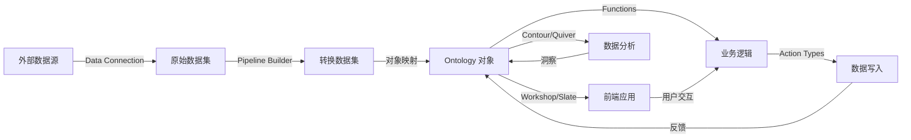
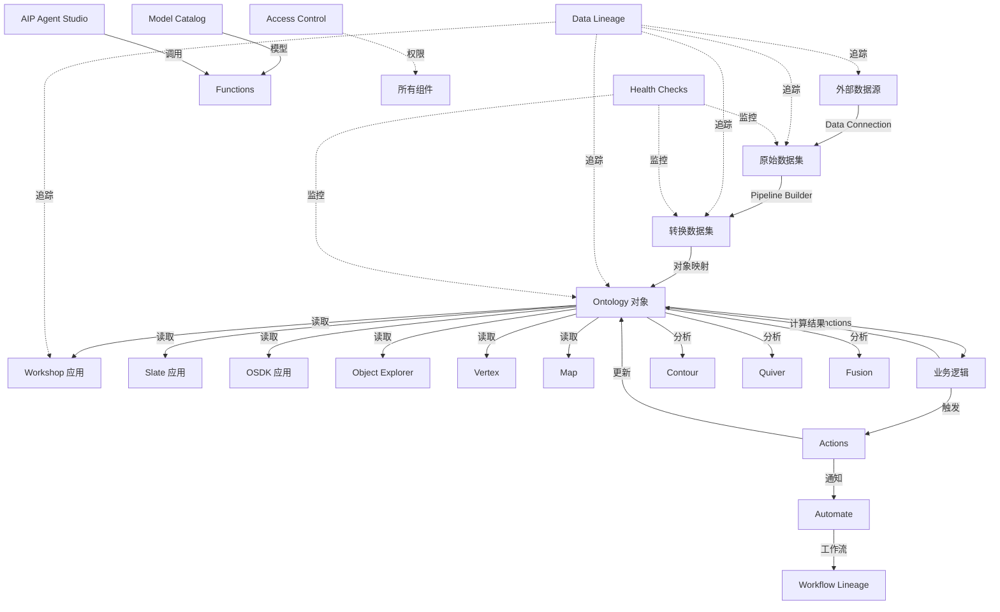
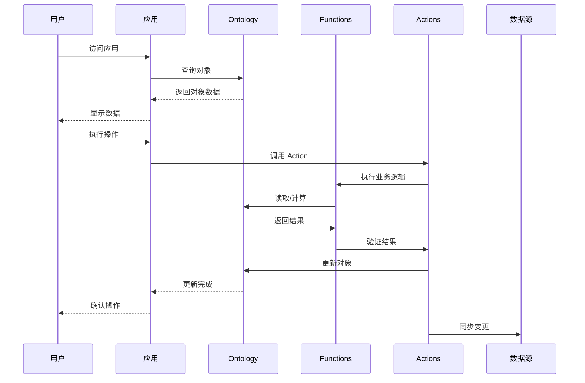

# Palantir Foundry 组件关系图

> 更新时间：2025-12-28

## 一、平台整体架构

### 1.1 平台分层架构

```
┌─────────────────────────────────────────────────────────────────────────────┐
│                           Palantir Foundry 平台                              │
├─────────────────────────────────────────────────────────────────────────────┤
│                                                                             │
│  ┌───────────────────────────────────────────────────────────────────────┐  │
│  │                        应用层 (Use Case Layer)                         │  │
│  │  ┌──────────────┐  ┌──────────────┐  ┌──────────────┐                │  │
│  │  │   Workshop   │  │    Slate     │  │   OSDK Apps  │  应用构建      │  │
│  │  └──────────────┘  └──────────────┘  └──────────────┘                │  │
│  │  ┌──────────────┐  ┌──────────────┐  ┌──────────────┐                │  │
│  │  │   Contour    │  │    Quiver    │  │    Fusion    │  数据分析      │  │
│  │  └──────────────┘  └──────────────┘  └──────────────┘                │  │
│  └───────────────────────────────────────────────────────────────────────┘  │
│                                      ↕                                       │
│  ┌───────────────────────────────────────────────────────────────────────┐  │
│  │                      本体层 (Ontology Layer)                           │  │
│  │  ┌──────────────┐  ┌──────────────┐  ┌──────────────┐                │  │
│  │  │ Object Types │  │  Link Types  │  │ Action Types │                │  │
│  │  └──────────────┘  └──────────────┘  └──────────────┘                │  │
│  │  ┌─────────────────────────────────────────────────────────────┐      │  │
│  │  │              Ontology Manager (核心枢纽)                     │      │  │
│  │  └─────────────────────────────────────────────────────────────┘      │  │
│  └───────────────────────────────────────────────────────────────────────┘  │
│                                      ↕                                       │
│  ┌───────────────────────────────────────────────────────────────────────┐  │
│  │                     逻辑层 (Logic Layer)                               │  │
│  │  ┌──────────────┐  ┌──────────────┐  ┌──────────────┐                │  │
│  │  │  Functions   │  │ AIP Logic    │  │Foundry Rules │                │  │
│  │  └──────────────┘  └──────────────┘  └──────────────┘                │  │
│  └───────────────────────────────────────────────────────────────────────┘  │
│                                      ↕                                       │
│  ┌───────────────────────────────────────────────────────────────────────┐  │
│  │                    数据层 (Data Layer)                                 │  │
│  │  ┌──────────────┐  ┌──────────────┐  ┌──────────────┐                │  │
│  │  │Data Connect  │  │ Pipeline     │  │  Code Repos  │                │  │
│  │  │    (200+)    │  │   Builder    │  │              │                │  │
│  │  └──────────────┘  └──────────────┘  └──────────────┘                │  │
│  └───────────────────────────────────────────────────────────────────────┘  │
│                                      ↕                                       │
│  ┌───────────────────────────────────────────────────────────────────────┐  │
│  │                   数据源层 (Source Layer)                               │  │
│  │  数据库 · SaaS · 文件系统 · API · 流数据 · ERP/CRM                     │  │
│  └───────────────────────────────────────────────────────────────────────┘  │
│                                                                             │
├─────────────────────────────────────────────────────────────────────────────┤
│  ┌───────────────────────────────────────────────────────────────────────┐  │
│  │                    横切关注点 (Cross-Cutting)                          │  │
│  │  ┌──────────────┐  ┌──────────────┐  ┌──────────────┐                │  │
│  │  │Data Lineage  │  │Access Control│  │Health Checks │  治理与安全    │  │
│  │  └──────────────┘  └──────────────┘  └──────────────┘                │  │
│  │  ┌──────────────┐  ┌──────────────┐  ┌──────────────┐                │  │
│  │  │Model Catalog │  │  AIP Agent   │  │Code Workspace│  AI/ML 能力    │  │
│  │  │              │  │   Studio     │  │              │                │  │
│  │  └──────────────┘  └──────────────┘  └──────────────┘                │  │
│  └───────────────────────────────────────────────────────────────────────┘  │
│                                                                             │
└─────────────────────────────────────────────────────────────────────────────┘
```

### 1.2 核心数据流



## 二、数据生命周期组件关系

### 2.1 数据接入与转换

```
┌─────────────────────────────────────────────────────────────────────────────┐
│                        数据接入与转换流程                                    │
├─────────────────────────────────────────────────────────────────────────────┤
│                                                                             │
│  外部数据源                                                                  │
│  ┌─────────────────────────────────────────────────────────────────────┐    │
│  │  数据库  ·  SaaS  ·  文件  ·  API  ·  流数据  ·  ERP/CRM             │    │
│  └─────────────────────────────────────────────────────────────────────┘    │
│                                   │                                         │
│                                   ▼                                         │
│  ┌─────────────────────────────────────────────────────────────────────┐    │
│  │                        Data Connection                               │    │
│  │  ┌──────────────────┐  ┌──────────────────┐  ┌──────────────────┐   │    │
│  │  │   直接连接       │  │   Agent 代理     │  │    Webhook       │   │    │
│  │  │   (JDBC/ODBC)    │  │  (本地采集器)    │  │   (推送模式)     │   │    │
│  │  └──────────────────┘  └──────────────────┘  └──────────────────┘   │    │
│  └─────────────────────────────────────────────────────────────────────┘    │
│                                   │                                         │
│                                   ▼                                         │
│  ┌─────────────────────────────────────────────────────────────────────┐    │
│  │                        原始数据集 (RDS)                               │    │
│  └─────────────────────────────────────────────────────────────────────┘    │
│                                   │                                         │
│                                   ▼                                         │
│  ┌─────────────────────────────────────────────────────────────────────┐    │
│  │                      Pipeline Builder                                │    │
│  │  ┌─────────────────────────────────────────────────────────────┐    │    │
│  │  │  数据源节点 → 转换节点 → 函数节点 → LLM节点 → 输出节点        │    │    │
│  │  └─────────────────────────────────────────────────────────────┘    │    │
│  │                                                                       │    │
│  │  点击式模式 ════════════ 代码模式 (Python/SQL/Spark)                 │    │
│  └─────────────────────────────────────────────────────────────────────┘    │
│                                   │                                         │
│                                   ▼                                         │
│  ┌─────────────────────────────────────────────────────────────────────┐    │
│  │                     转换数据集 (TDS)                                  │    │
│  └─────────────────────────────────────────────────────────────────────┘    │
│                                   │                                         │
│                                   ▼                                         │
│  ┌─────────────────────────────────────────────────────────────────────┐    │
│  │                   Ontology Manager (对象映射)                        │    │
│  │  ┌──────────────────┐  ┌──────────────────┐  ┌──────────────────┐   │    │
│  │  │  对象类型定义    │  │  链接类型定义    │  │  属性映射        │   │    │
│  │  └──────────────────┘  └──────────────────┘  └──────────────────┘   │    │
│  └─────────────────────────────────────────────────────────────────────┘    │
│                                   │                                         │
│                                   ▼                                         │
│  ┌─────────────────────────────────────────────────────────────────────┐    │
│  │                      Ontology 对象实例                               │    │
│  └─────────────────────────────────────────────────────────────────────┘    │
│                                                                             │
└─────────────────────────────────────────────────────────────────────────────┘
```

### 2.2 数据谱系追踪

```
                    Data Lineage (数据谱系)
                            │
        ┌───────────────────┼───────────────────┐
        │                   │                   │
        ▼                   ▼                   ▼
   ┌─────────┐        ┌─────────┐        ┌─────────┐
   │ 数据源  │        │ 管道    │        │ 数据集  │
   │ 影响    │        │ 依赖    │        │ 依赖    │
   │ 分析    │        │ 关系    │        │ 关系    │
   └─────────┘        └─────────┘        └─────────┘
        │                   │                   │
        └───────────────────┼───────────────────┘
                            │
                            ▼
                    ┌─────────────┐
                    │   应用层    │
                    │   依赖      │
                    │   关系      │
                    └─────────────┘
```

## 三、Ontology 组件关系

### 3.1 Ontology 核心组件

```
┌─────────────────────────────────────────────────────────────────────────────┐
│                        Ontology 核心架构                                     │
├─────────────────────────────────────────────────────────────────────────────┤
│                                                                             │
│  ┌─────────────────────────────────────────────────────────────────────┐  │
│  │                         Ontology Manager                             │  │
│  │                        (本体管理核心)                                 │  │
│  │  ┌─────────────────────────────────────────────────────────────┐    │  │
│  │  │                                                             │    │  │
│  │  │  对象类型 (Object Types)                                     │    │  │
│  │  │  ├── 标识符 (Identifier)                                    │    │  │
│  │  │  ├── 属性 (Properties)                                      │    │  │
│  │  │  └── 值类型 (Value Types)                                   │    │  │
│  │  │                                                             │    │  │
│  │  │  链接类型 (Link Types) ──────────┐                          │    │  │
│  │  │  ├── 源对象类型                  │                          │    │  │
│  │  │  ├── 目标对象类型                │                          │    │  │
│  │  │  └── 链接属性                    │                          │    │  │
│  │  │                                │                          │    │  │
│  │  │  操作类型 (Action Types) ◄──────┼──────────────────┐       │    │  │
│  │  │  ├── 参数定义                   │                  │       │    │  │
│  │  │  ├── 提交标准                   │                  │       │    │  │
│  │  │  └── 副作用配置                 │                  │       │    │  │
│  │  │                                │                  │       │    │  │
│  │  └────────────────────────────────┼──────────────────┼───────┘    │  │
│  │                                   │                  │           │  │
│  └───────────────────────────────────┼──────────────────┼───────────┘  │
│                                      │                  │               │
│            ┌─────────────────────────┘                  │               │
│            │                                    ┌───────┴───────┐       │
│            ▼                                    ▼               ▼       │
│  ┌───────────────────┐              ┌──────────────────┐ ┌────────────┐ │
│  │    Functions      │              │ Foundry Rules    │ │AIP Logic   │ │
│  │  ┌─────────────┐  │              │  ┌────────────┐  │ │            │ │
│  │  │对象查询     │  │              │  │业务规则    │  │ │ LLM 驱动  │ │
│  │  │聚合计算     │  │              │  │条件逻辑    │  │ │ 的函数    │ │
│  │  │本体编辑     │  │              │  │验证规则    │  │ │            │ │
│  │  │外部 API     │  │              │  │工作流触发  │  │ └────────────┘ │
│  │  └─────────────┘  │              │  └────────────┘  │                 │
│  │       │           │              │       │          │                 │
│  └───────┼───────────┘              └───────┼──────────┘                 │
│          │                                   │                            │
│          └─────────────┬─────────────────────┘                            │
│                        │                                                  │
│                        ▼                                                  │
│  ┌─────────────────────────────────────────────────────────────────────┐  │
│  │                      Ontology 对象实例                               │  │
│  └─────────────────────────────────────────────────────────────────────┘  │
│          │           │           │           │           │               │
│          ▼           ▼           ▼           ▼           ▼               │
│  ┌──────────┐ ┌──────────┐ ┌──────────┐ ┌──────────┐ ┌──────────┐       │
│  │ Explorer ││  Views   ││  Vertex  ││   Map    ││ Machinery│       │
│  └──────────┘ └──────────┘ └──────────┘ └──────────┘ └──────────┘       │
│                                                                             │
└─────────────────────────────────────────────────────────────────────────────┘
```

### 3.2 对象关系可视化

```
┌─────────────────────────────────────────────────────────────────────────────┐
│                        对象关系网络 (Vertex)                                 │
├─────────────────────────────────────────────────────────────────────────────┤
│                                                                             │
│                    ┌─────────────┐                                         │
│                    │   设备 A    │                                         │
│                    │  (Device)   │                                         │
│                    └──────┬──────┘                                         │
│                           │ 包含                                           │
│                           ▼                                                │
│              ┌─────────────────────────┐                                    │
│              │      传感器组           │                                    │
│              │   (Sensor Group)        │──────────┐                         │
│              └───────────┬─────────────┘          │                         │
│                          │ 监控                   │ 监控                    │
│          ┌───────────────┼───────────────┐        │                         │
│          ▼               ▼               ▼        ▼                         │
│  ┌─────────────┐ ┌─────────────┐ ┌─────────────┐ ┌─────────────┐           │
│  │ 温度传感器  │ │ 压力传感器  │ │ 振动传感器  │ │ 事件记录    │           │
│  │ (Sensor)    │ │ (Sensor)    │ │ (Sensor)    │ │  (Event)    │           │
│  └─────────────┘ └─────────────┘ └─────────────┘ └─────────────┘           │
│          │               │               │           │                     │
│          └───────────────┴───────────────┴───────────┘                     │
│                              │                                               │
│                              ▼                                               │
│                    ┌─────────────┐                                         │
│                    │  分析结果   │                                         │
│                    │ (Analysis)  │                                         │
│                    └─────────────┘                                         │
│                                                                             │
└─────────────────────────────────────────────────────────────────────────────┘
```

## 四、应用开发组件关系

### 4.1 应用开发工具链

```
┌─────────────────────────────────────────────────────────────────────────────┐
│                        应用开发工具链                                        │
├─────────────────────────────────────────────────────────────────────────────┤
│                                                                             │
│  开发复杂度                                                                  │
│       │                                                                     │
│       │ 低    ┌─────────────────────────────────────────┐    高             │
│       │      │                                         │                   │
│       │      ▼                                         ▼                   │
│       │  ┌─────────────┐                         ┌─────────────┐           │
│       │  │  Workshop   │                         │   OSDK      │           │
│       │  │ (无/低代码) │                         │  (全代码)   │           │
│       │  │             │                         │             │           │
│       │  │ • 小部件库  │                         │ • TypeScript│           │
│       │  │ • 拖放构建  │                         │ • Python    │           │
│       │  │ • 快速开发  │                         │ • Java      │           │
│       │  └──────┬──────┘                         │ • 本地开发  │           │
│       │         │                                └──────┬──────┘           │
│       │         │                                       │                   │
│       │         ▼                                       ▼                   │
│       │  ┌─────────────┐                         ┌─────────────┐           │
│       │  │   Slate     │                         │Custom Widget│          │
│       │  │ (拖放界面)  │                         │  (自定义)   │           │
│       │  │             │                         │             │           │
│       │  │ • 自定义设计│                         │ • 高度定制  │           │
│       │  │ • CSS 样式  │                         │ • Workshop  │           │
│       │  │ • 公共访问  │                         │   集成      │           │
│       │  └──────┬──────┘                         └─────────────┘           │
│       │         │                                                             │
│       │         └────────────────────┬────────────────────────┐             │
│       │                              │                        │             │
│       │                              ▼                        ▼             │
│       │                    ┌───────────────┐          ┌───────────────┐    │
│       │                    │    Carbon     │          │ Workflow      │    │
│       │                    │ (工作空间)    │          │ Lineage       │    │
│       │                    │               │          │               │    │
│       │                    │ • 导航配置    │          │ • 工作流管理  │    │
│       │                    │ • 应用集合    │          │ • 依赖追踪    │    │
│       │                    └───────────────┘          └───────────────┘    │
│       │                                                              │      │
│       └──────────────────────────────────────────────────────────────┘      │
│                                        │                                    │
│                                        ▼                                    │
│                        ┌───────────────────────────────┐                    │
│                        │       Ontology 数据层        │                    │
│                        │  Objects · Links · Actions   │                    │
│                        └───────────────────────────────┘                    │
│                                                                             │
└─────────────────────────────────────────────────────────────────────────────┘
```

### 4.2 应用集成关系

```
┌─────────────────────────────────────────────────────────────────────────────┐
│                        应用集成与交互                                        │
├─────────────────────────────────────────────────────────────────────────────┤
│                                                                             │
│  ┌─────────────────────────────────────────────────────────────────────┐  │
│  │                    Cross-Application Interactivity                   │  │
│  │                        (跨应用交互)                                   │  │
│  │                                                                       │  │
│  │  ┌──────────────┐          拖放数据          ┌──────────────┐        │  │
│  │  │   应用 A     │ ──────────────────────────│   应用 B     │        │  │
│  │  │  (Workshop)  │                           │   (Slate)    │        │  │
│  │  └──────────────┘                           └──────────────┘        │  │
│  │         │                                          │                │  │
│  │         │         应用配对和状态同步               │                │  │
│  │         └──────────────────────────────────────────┘                │  │
│  │                              │                                      │  │
│  │                              ▼                                      │  │
│  │                    ┌───────────────────┐                            │  │
│  │                    │    命令系统       │                            │  │
│  │                    │  (Command System) │                            │  │
│  │                    └───────────────────┘                            │  │
│  └─────────────────────────────────────────────────────────────────────┘  │
│                                                                             │
│  ┌─────────────────────────────────────────────────────────────────────┐  │
│  │                        应用嵌入关系                                   │  │
│  │                                                                       │  │
│  │  Workshop 应用                                                        │  │
│  │  ├── 嵌入 Slate 模块                                                  │  │
│  │  ├── 嵌入 Contour 视图                                                │  │
│  │  ├── 嵌入 Quiver 卡片                                                 │  │
│  │  ├── 嵌入 Notepad 文档                                                │  │
│  │  └── 嵌入自定义 Widget                                                │  │
│  │                                                                       │  │
│  │  Object Views                                                         │  │
│  │  ├── 集成 Workshop 面板                                               │  │
│  │  ├── 集成 Vertex 视图                                                 │  │
│  │  ├── 集成 Map 视图                                                    │  │
│  │  └── 集成自定义视图                                                   │  │
│  │                                                                       │  │
│  └─────────────────────────────────────────────────────────────────────┘  │
│                                                                             │
└─────────────────────────────────────────────────────────────────────────────┘
```

## 五、AI/ML 组件关系

### 5.1 AI/ML 能力栈

```
┌─────────────────────────────────────────────────────────────────────────────┐
│                        AI/ML 能力栈                                         │
├─────────────────────────────────────────────────────────────────────────────┤
│                                                                             │
│  ┌─────────────────────────────────────────────────────────────────────┐  │
│  │                    应用层 (AI 应用)                                   │  │
│  │  ┌──────────────┐  ┌──────────────┐  ┌──────────────┐               │  │
│  │  │ AI Assistant │  │ 智能推荐     │  │ 自动化决策   │               │  │
│  │  └──────────────┘  └──────────────┘  └──────────────┘               │  │
│  └─────────────────────────────────────────────────────────────────────┘  │
│                                  │                                          │
│                                  ▼                                          │
│  ┌─────────────────────────────────────────────────────────────────────┐  │
│  │                   AIP Agent Studio (AI 代理工作室)                   │  │
│  │  ┌─────────────────────────────────────────────────────────────┐    │  │
│  │  │  第 1 层: 对话管理 - 聊天界面、上下文管理                      │    │  │
│  │  │  第 2 层: 工具使用 - 函数调用、Action 执行                      │    │  │
│  │  │  第 3 层: 企业知识 - Ontology 对象、文档                        │    │  │
│  │  │  第 4 层: AI 模型 - LLM 推理、规划                              │    │  │
│  │  └─────────────────────────────────────────────────────────────┘    │  │
│  └─────────────────────────────────────────────────────────────────────┘  │
│                                  │                                          │
│              ┌─────────────────────┼─────────────────────┐                 │
│              ▼                     ▼                     ▼                 │
│  ┌───────────────────┐ ┌───────────────────┐ ┌───────────────────┐        │
│  │    AIP Logic      │ │   Model Catalog   │ │  AIP Assist       │        │
│  │  ┌─────────────┐  │ │  ┌─────────────┐  │ │  ┌─────────────┐  │        │
│  │  │ LLM 函数    │  │ │  │ LLMs        │  │ │  │ 文档检索    │  │        │
│  │  │ 无/低代码   │  │ │  │ 嵌入模型    │  │ │  │ 代码补全    │  │        │
│  │  │ AI 逻辑     │  │ │  │ Foundry    │  │ │  │ 最佳实践    │  │        │
│  │  │             │  │ │  │ 模型       │  │ │  │             │  │        │
│  │  └─────────────┘  │ │  └─────────────┘  │ │  └─────────────┘  │        │
│  └───────────────────┘ └───────────────────┘ └───────────────────┘        │
│              │                     │                     │                 │
│              └─────────────────────┼─────────────────────┘                 │
│                                    ▼                                       │
│  ┌─────────────────────────────────────────────────────────────────────┐  │
│  │                    Code Workspaces (开发环境)                        │  │
│  │  ┌──────────────┐  ┌──────────────┐  ┌──────────────┐               │  │
│  │  │ JupyterLab   │  │ RStudio      │  │ VS Code      │               │  │
│  │  └──────────────┘  └──────────────┘  └──────────────┘               │  │
│  └─────────────────────────────────────────────────────────────────────┘  │
│                                  │                                          │
│                                  ▼                                          │
│  ┌─────────────────────────────────────────────────────────────────────┐  │
│  │                Modeling Objectives (模型生命周期管理)                 │  │
│  │  ┌─────────────────────────────────────────────────────────────┐    │  │
│  │  │ 提交 → 发布 → 部署 → 监控 → 版本管理 → CI/CD 集成              │    │  │
│  │  └─────────────────────────────────────────────────────────────┘    │  │
│  └─────────────────────────────────────────────────────────────────────┘  │
│                                                                             │
└─────────────────────────────────────────────────────────────────────────────┘
```

### 5.2 AI 与 Ontology 集成

```
┌─────────────────────────────────────────────────────────────────────────────┐
│                     AI 与 Ontology 集成关系                                  │
├─────────────────────────────────────────────────────────────────────────────┤
│                                                                             │
│  ┌─────────────────────────────────────────────────────────────────────┐  │
│  │                        LLM 推理层                                     │  │
│  │                        ┌─────────────┐                               │  │
│  │                        │ LLM 模型    │                               │  │
│  │                        └──────┬──────┘                               │  │
│  │                               │                                       │  │
│  └───────────────────────────────┼───────────────────────────────────────┘  │
│                                  │                                          │
│              ┌───────────────────┼───────────────────┐                     │
│              ▼                   ▼                   ▼                     │
│  ┌─────────────────┐   ┌─────────────────┐   ┌─────────────────┐           │
│  │  AIP Logic      │   │ AIP Agent       │   │ 语义搜索        │           │
│  │  Functions      │   │ Studio          │   │                 │           │
│  │                 │   │                 │   │ 向量嵌入        │           │
│  │ LLM 驱动的函数  │   │ 企业知识库      │   │ 对象检索        │           │
│  └────────┬────────┘   └────────┬────────┘   └────────┬────────┘           │
│           │                     │                     │                     │
│           └─────────────────────┼─────────────────────┘                     │
│                                 ▼                                           │
│  ┌─────────────────────────────────────────────────────────────────────┐  │
│  │                        Ontology 对象层                               │  │
│  │  ┌──────────────┐  ┌──────────────┐  ┌──────────────┐              │  │
│  │  │ 业务对象     │  │ 对象属性     │  │ 对象关系     │              │  │
│  │  │ (Objects)    │  │ (Properties) │  │ (Links)      │              │  │
│  │  └──────────────┘  └──────────────┘  └──────────────┘              │  │
│  └─────────────────────────────────────────────────────────────────────┘  │
│                                 │                                           │
│                                 ▼                                           │
│  ┌─────────────────────────────────────────────────────────────────────┐  │
│  │                        Functions 执行层                               │  │
│  │  ┌─────────────────────────────────────────────────────────────┐    │  │
│  │  │ 对象查询 · 聚合计算 · 本体编辑 · 外部 API 调用               │    │  │
│  │  └─────────────────────────────────────────────────────────────┘    │  │
│  └─────────────────────────────────────────────────────────────────────┘  │
│                                                                             │
└─────────────────────────────────────────────────────────────────────────────┘
```

## 六、安全与治理组件关系

### 6.1 治理与安全架构

```
┌─────────────────────────────────────────────────────────────────────────────┐
│                        治理与安全架构                                        │
├─────────────────────────────────────────────────────────────────────────────┤
│                                                                             │
│  ┌─────────────────────────────────────────────────────────────────────┐  │
│  │                      访问控制 (Access Control)                        │  │
│  │  ┌─────────────────────────────────────────────────────────────┐    │  │
│  │  │  基于角色的访问控制 (RBAC)                                    │    │  │
│  │  │  ├── 用户组管理                                             │    │  │
│  │  │  ├── 角色定义                                               │    │  │
│  │  │  └── 权限分配                                               │    │  │
│  │  │                                                             │    │  │
│  │  │  标记和目的授权 (Purpose-based)                              │    │  │
│  │  │  ├── 数据标记                                               │    │  │
│  │  │  ├── 使用目的                                               │    │  │
│  │  │  └── 动态授权                                               │    │  │
│  │  │                                                             │    │  │
│  │  │  对象级权限管理                                             │    │  │
│  │  │  ├── 行级安全                                               │    │  │
│  │  │  ├── 列级安全                                               │    │  │
│  │  │  └── 属性级安全                                             │    │  │
│  │  └─────────────────────────────────────────────────────────────┘    │  │
│  └─────────────────────────────────────────────────────────────────────┘  │
│                                  │                                          │
│                                  ▼                                          │
│  ┌─────────────────────────────────────────────────────────────────────┐  │
│  │                    数据谱系 (Data Lineage)                            │  │
│  │  ┌─────────────────────────────────────────────────────────────┐    │  │
│  │  │  数据源 → 管道 → 数据集 → 对象 → 应用                        │    │  │
│  │  │                                                             │    │  │
│  │  │  影响分析                                                   │    │  │
│  │  │  ├── 上游影响 (数据源变更影响)                               │    │  │
│  │  │  ├── 下游影响 (数据集使用情况)                               │    │  │
│  │  │  └── 依赖关系追踪                                           │    │  │
│  │  └─────────────────────────────────────────────────────────────┘    │  │
│  └─────────────────────────────────────────────────────────────────────┘  │
│                                  │                                          │
│                                  ▼                                          │
│  ┌─────────────────────────────────────────────────────────────────────┐  │
│  │                   数据健康 (Data Health)                              │  │
│  │  ┌─────────────────────────────────────────────────────────────┐    │  │
│  │  │  数据期望 (Data Expectations)                                │    │  │
│  │  │  ├── 完整性检查                                             │    │  │
│  │  │  ├── 格式验证                                               │    │  │
│  │  │  └── 业务规则                                               │    │  │
│  │  │                                                             │    │  │
│  │  │  健康仪表板                                                 │    │  │
│  │  │  ├── 数据质量评分                                           │    │  │
│  │  │  ├── 异常检测                                               │    │  │
│  │  │  └── 趋势监控                                               │    │  │
│  │  └─────────────────────────────────────────────────────────────┘    │  │
│  └─────────────────────────────────────────────────────────────────────┘  │
│                                  │                                          │
│                                  ▼                                          │
│  ┌─────────────────────────────────────────────────────────────────────┐  │
│  │                   审计与合规 (Audit & Compliance)                     │  │
│  │  ┌─────────────────────────────────────────────────────────────┐    │  │
│  │  │  审计日志                                                   │    │  │
│  │  │  ├── 用户操作记录                                           │    │  │
│  │  │  ├── 数据访问记录                                           │    │  │
│  │  │  └── 权限变更记录                                           │    │  │
│  │  │                                                             │    │  │
│  │  │  合规性检查                                                 │    │  │
│  │  │  ├── GDPR 合规                                              │    │  │
│  │  │  ├── 数据保留策略                                           │    │  │
│  │  │  └── 隐私保护                                               │    │  │
│  │  └─────────────────────────────────────────────────────────────┘    │  │
│  └─────────────────────────────────────────────────────────────────────┘  │
│                                                                             │
└─────────────────────────────────────────────────────────────────────────────┘
```

### 6.2 代码质量与检查

```
┌─────────────────────────────────────────────────────────────────────────────┐
│                        代码质量与检查                                        │
├─────────────────────────────────────────────────────────────────────────────┤
│                                                                             │
│  ┌─────────────────────────────────────────────────────────────────────┐  │
│  │                        Linter (代码检查器)                            │  │
│  │  ┌─────────────────────────────────────────────────────────────┐    │  │
│  │  │  代码质量检查                                               │    │  │
│  │  │  ├── 代码风格一致性                                         │    │  │
│  │  │  ├── 潜在错误检测                                           │    │  │
│  │  │  ├── 性能问题识别                                           │    │  │
│  │  │  └── 安全漏洞扫描                                           │    │  │
│  │  │                                                             │    │  │
│  │  │  推荐规则                                                   │    │  │
│  │  │  ├── Foundry 最佳实践                                       │    │  │
│  │  │  ├── 行业标准                                               │    │  │
│  │  │  └── 自定义规则                                             │    │  │
│  │  │                                                             │    │  │
│  │  │  扫描调度                                                   │    │  │
│  │  │  ├── 定期扫描                                               │    │  │
│  │  │  ├── 提交前检查                                             │    │  │
│  │  │  └── CI/CD 集成                                             │    │  │
│  │  │                                                             │    │  │
│  │  │  影响追踪                                                   │    │  │
│  │  │  ├── 问题追踪                                               │    │  │
│  │  │  ├── 修复建议                                               │    │  │
│  │  │  └── 进度监控                                               │    │  │
│  │  └─────────────────────────────────────────────────────────────┘    │  │
│  └─────────────────────────────────────────────────────────────────────┘  │
│                                                                             │
└─────────────────────────────────────────────────────────────────────────────┘
```

## 七、典型用例组件关系

### 7.1 实时监控应用

```
┌─────────────────────────────────────────────────────────────────────────────┐
│                        实时监控应用架构                                      │
├─────────────────────────────────────────────────────────────────────────────┤
│                                                                             │
│  ┌─────────────────────────────────────────────────────────────────────┐  │
│  │  IoT 设备 / 传感器                                                   │  │
│  │  ┌──────────────┐  ┌──────────────┐  ┌──────────────┐              │  │
│  │  │ 温度传感器   │  │ 压力传感器   │  │ 振动传感器   │              │  │
│  │  └──────────────┘  └──────────────┘  └──────────────┘              │  │
│  └─────────────────────────────────────────────────────────────────────┘  │
│                                  │                                          │
│                                  ▼ (流数据)                                 │
│  ┌─────────────────────────────────────────────────────────────────────┐  │
│  │  Data Connection (流数据连接)                                        │  │
│  └─────────────────────────────────────────────────────────────────────┘  │
│                                  │                                          │
│                                  ▼                                          │
│  ┌─────────────────────────────────────────────────────────────────────┐  │
│  │  Pipeline Builder (流处理管道)                                       │  │
│  │  ┌─────────────────────────────────────────────────────────────┐    │  │
│  │  │ 数据清洗 → 特征提取 → 异常检测 → 实时聚合                     │    │  │
│  │  └─────────────────────────────────────────────────────────────┘    │  │
│  └─────────────────────────────────────────────────────────────────────┘  │
│                                  │                                          │
│                                  ▼                                          │
│  ┌─────────────────────────────────────────────────────────────────────┐  │
│  │  Ontology 对象                                                       │  │
│  │  ┌─────────────────────────────────────────────────────────────┐    │  │
│  │  │ 设备对象 (Device)                                            │    │  │
│  │  │ ├── 当前属性值                                               │    │  │
│  │  │ ├── 历史时间序列                                             │    │  │
│  │  │ └── 告警状态                                                 │    │  │
│  │  └─────────────────────────────────────────────────────────────┘    │  │
│  └─────────────────────────────────────────────────────────────────────┘  │
│                                  │                                          │
│              ┌─────────────────────┼─────────────────────┐                 │
│              ▼                     ▼                     ▼                 │
│  ┌─────────────────┐   ┌─────────────────┐   ┌─────────────────┐           │
│  │   Workshop      │   │     Quiver      │   │   Machinery     │           │
│  │   实时仪表板    │   │   时间序列      │   │   流程挖掘      │           │
│  │                 │   │   分析          │   │                 │           │
│  │ • 设备状态      │   │ • 趋势分析      │   │ • 流程监控      │           │
│  │ • 告警通知      │   │ • 预测          │   │ • 性能指标      │           │
│  │ • Map 视图      │   │ • 异常检测      │   │ • 瓶颈识别      │           │
│  └─────────────────┘   └─────────────────┘   └─────────────────┘           │
│              │                     │                     │                 │
│              └─────────────────────┼─────────────────────┘                 │
│                                    ▼                                       │
│  ┌─────────────────────────────────────────────────────────────────────┐  │
│  │  Foundry Rules (告警规则)                                            │  │
│  │  ┌─────────────────────────────────────────────────────────────┐    │  │
│  │  │ IF 温度 > 阈值 AND 持续时间 > 5分钟 THEN 触发告警              │    │  │
│  │  └─────────────────────────────────────────────────────────────┘    │  │
│  └─────────────────────────────────────────────────────────────────────┘  │
│                                  │                                          │
│                                  ▼                                          │
│  ┌─────────────────────────────────────────────────────────────────────┐  │
│  │  Automate (自动化响应)                                              │  │
│  │  ┌─────────────────────────────────────────────────────────────┐    │  │
│  │  │ • 发送通知                                                   │    │  │
│  │  │ • 执行 Action (调整设备参数)                                  │    │  │
│  │  │ • 创建维护工单                                               │    │  │
│  │  └─────────────────────────────────────────────────────────────┘    │  │
│  └─────────────────────────────────────────────────────────────────────┘  │
│                                                                             │
└─────────────────────────────────────────────────────────────────────────────┘
```

### 7.2 供应链优化应用

```
┌─────────────────────────────────────────────────────────────────────────────┐
│                        供应链优化应用架构                                    │
├─────────────────────────────────────────────────────────────────────────────┤
│                                                                             │
│  ┌─────────────────────────────────────────────────────────────────────┐  │
│  │  外部系统                                                             │  │
│  │  ┌──────────────┐  ┌──────────────┐  ┌──────────────┐              │  │
│  │  │   ERP        │  │   CRM        │  │  供应商系统  │              │  │
│  │  │  (SAP/Oracle)│  │ (Salesforce) │  │   (API)      │              │  │
│  │  └──────────────┘  └──────────────┘  └──────────────┘              │  │
│  └─────────────────────────────────────────────────────────────────────┘  │
│                                  │                                          │
│                                  ▼                                          │
│  ┌─────────────────────────────────────────────────────────────────────┐  │
│  │  HyperAuto (自动化数据集成)                                          │  │
│  │  ┌─────────────────────────────────────────────────────────────┐    │  │
│  │  │ 自动发现 ERP 表结构 · 自动生成数据管道                        │    │  │
│  │  └─────────────────────────────────────────────────────────────┘    │  │
│  └─────────────────────────────────────────────────────────────────────┘  │
│                                  │                                          │
│                                  ▼                                          │
│  ┌─────────────────────────────────────────────────────────────────────┐  │
│  │  Pipeline Builder (数据转换)                                         │  │
│  │  ┌─────────────────────────────────────────────────────────────┐    │  │
│  │  │ 数据清洗 · 标准化 · 丰富 · 聚合                                │    │  │
│  │  └─────────────────────────────────────────────────────────────┘    │  │
│  └─────────────────────────────────────────────────────────────────────┘  │
│                                  │                                          │
│                                  ▼                                          │
│  ┌─────────────────────────────────────────────────────────────────────┐  │
│  │  Ontology 对象模型                                                  │  │
│  │  ┌─────────────────────────────────────────────────────────────┐    │  │
│  │  │                                                             │    │  │
│  │  │  供应商 ───[供应]───→ 产品 ───[包含]──→ 组件                │    │  │
│  │  │    │                    │                    │               │    │  │
│  │  │    │                    │                    │               │    │  │
│  │  │  [合同]              [订单]              [库存]               │    │  │
│  │  │    │                    │                    │               │    │  │
│  │  │    └──────[交付]────────┴────[运输]───────────┘               │    │  │
│  │  │                                                             │    │  │
│  │  └─────────────────────────────────────────────────────────────┘    │  │
│  └─────────────────────────────────────────────────────────────────────┘  │
│                                  │                                          │
│              ┌─────────────────────┼─────────────────────┐                 │
│              ▼                     ▼                     ▼                 │
│  ┌─────────────────┐   ┌─────────────────┐   ┌─────────────────┐           │
│  │   Vertex        │   │ Dynamic         │   │   AIP Agent     │           │
│  │   关系网络       │   │ Scheduling      │   │   Studio        │           │
│  │                 │   │                 │   │                 │           │
│  │ • 供应网络      │   │ • 需求预测      │   │ • 智能采购      │           │
│  │ • 风险传播      │   │ • 库存优化      │   │ • 供应商评估    │           │
│  │ • 替代方案      │   │ • 物流调度      │   │ • 合同分析      │           │
│  └─────────────────┘   └─────────────────┘   └─────────────────┘           │
│              │                     │                     │                 │
│              └─────────────────────┼─────────────────────┘                 │
│                                    ▼                                       │
│  ┌─────────────────────────────────────────────────────────────────────┐  │
│  │  Workshop 应用                                                       │  │
│  │  ┌─────────────────────────────────────────────────────────────┐    │  │
│  │  │ 供应链控制台 · 供应商管理 · 订单跟踪 · 风险仪表板              │    │  │
│  │  └─────────────────────────────────────────────────────────────┘    │  │
│  └─────────────────────────────────────────────────────────────────────┘  │
│                                                                             │
└─────────────────────────────────────────────────────────────────────────────┘
```

## 八、数据流向关系

### 8.1 核心数据流



### 8.2 用户交互流



---

*本文档基于 Palantir Foundry 官方文档整理*
